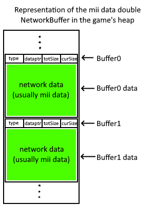
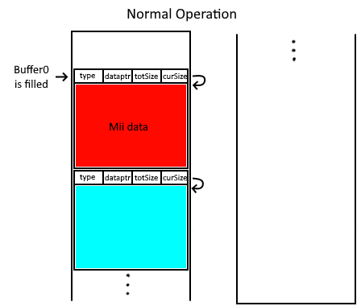

# ENLBufferPwn (*CVE ID Pending*)

<p align="center">

</p>

<table align="center">
<tr>
<td>CVE:</td>
<td><i>Pending</i></td>
</tr>
<tr>
<td>Authors:</td>
<td><a href=https://github.com/PabloMK7>PabloMK7</a>, <a href=https://github.com/Rambo6Glaz>Rambo6Glaz</a>, <a href=https://github.com/fishguy6564>Fishguy6564</a></td>
</tr>
<tr>
<td>Reported:</td>
<td>August 8th, 2021 (Mario Kart 7) <br> April 14th, 2022 (Mario Kart 8)  </td>
</tr>
<tr>
<td>Disclosed:</td>
<td>December 22nd, 2022</td>
</tr>
</table>

## Table of contents
* [Description](#description)
* [Vulnerability details](#vulnerability-details)
* [ENLBufferPwn in Mario Kart 7 (3DS)](#enlbufferpwn-in-mario-kart-7-3ds)
  + [Technical details](#technical-details)
* [ENLBufferPwn in Mario Kart 8 (Wii U)](#enlbufferpwn-in-mario-kart-8-wii-u)
  + [Technical details](#technical-details-1)
* [Credits](#credits)
* [License](#license)

## Description

**ENLBufferPwn** is a vulnerability in the common network code of several first party Nintendo games since the Nintendo 3DS that allows an attacker to execute code remotely in the victim's console by just having an online game with them (remote code execution). It was dicovered by multiple people independently during 2021 and reported to Nintendo during 2022. Since the initial report, Nintendo has patched the vulnerability in many vulnerable games. The information in this repository has been safely disclosed after getting permission from Nintendo.

The vulnerability has scored a **[9.8/10 (Critical)](https://www.first.org/cvss/calculator/3.1#CVSS:3.1/AV:N/AC:L/PR:N/UI:N/S:U/C:H/I:H/A:H)** in the CVSS 3.1 calculator.

Here is a list of games that are known to have had the vulnerability at some point (all the Switch and 3DS games listed have received updates that patch the vulnerability, so they are no longer affected):
- Mario Kart 7 (fixed in v1.2)
- Mario Kart 8 (still not fixed)
- Mario Kart 8 Deluxe (fixed in v2.1.0)
- Animal Crossing: New Horizons (fixed in v2.0.6)
- ARMS (fixed in v5.4.1)
- Splatoon (still not fixed)
- Splatoon 2 (fixed in v5.5.1)
- Splatoon 3 (fixed in late 2022, exact version unknown)
- Super Mario Maker 2 (fixed in v3.0.2)
- Nintendo Switch Sports (fixed in late 2022, exact version unknown)
- *Probably more...*

## Vulnerability details
The **ENLBufferPwn** vulnerability exploits a buffer overflow in the C++ class `NetworkBuffer` present in the network library `enl` (`Net` in Mario Kart 7) used by many first party Nintendo games. This class contains two methods `Add` and `Set` which fill a network buffer with data coming from other players. However, none of those methods check that the input data actually fits in the network buffer. Since the input data is controllable, a buffer overflow can be triggered on a remote console by just having an online game session with the attacker. If done properly, the victim user may not even notice a vulnerability was triggered in their console. The consequences of this buffer overflow vary on the game, from simple inoffensive modifications to the game's memory ([like repeatedly opening and closing the home menu on the 3DS](https://www.youtube.com/watch?v=nVCPjUrkfPg)) to more severe actions like taking full control of the console, as shown below.

The rest of the report will focus on Mario Kart 7, as due to the lack of security measures (ASLR, for example) of the 3DS, it is the most severe case of the vulnerability. However, it may be possible to bypass ASLR on Switch games by hijacking the `NetworkBuffer` used to send data back to the attacker (and making it leak pointers to the heap and code).

## ENLBufferPwn in Mario Kart 7 (3DS)
The following video showcases a severe case of the vulnerability in Mario Kart 7, where a console controlled by an attacker (left side) fully takes over an unmodified console (right side). The only interaction done by the user is joining an online game session with the attacker, in this case, using the "communities" feature (note that a "community" was used to safely test the vulnerability in an isolated manner and not affect any other users playing in public lobbies). The takeover is done by copying a ROP payload to the remote console and then executing it. This ROP payload then uses other vulnerabilities in the OS to escalate privileges and get total control. In the video, the remote console is forced to run a CFW installer (`SafeB9SInstaller`). Using the same tchniques, it would be theoretically possible to **steal account/credit card information** or **take unauthorized audio/video recordings using the console built-in mic/cameras**.

[](https://www.youtube.com/watch?v=PLAVmp5ky-k)

### Technical details
As previously stated, the vulnerability comes from an oversight in two methods of the class `NetworkBuffer`. Here is an implementation of the class and methods in C++:

```cpp
class NetworkBuffer
{
public:
    u8	bufferType;
    u8* dataPtr;
    u32 dataSize;
    u32 currentSize;

    void Set(u8* newData, u32 newDataSize);
    void Add(u8* newData, u32 newDataSize);
}

void NetworkBuffer::Set(u8* newData, u32 newDataSize)
{
    memcpy(this->dataPtr, newData, newDataSize);
    this->currentSize = newDataSize;
}

void NetworkBuffer::Add(u8* newData, u32 newDataSize)
{
    memcpy(this->dataPtr + this->currentSize, newData, newDataSize);
    this->currentSize += newDataSize;
}
```

As you can see, neither `Set` nor `Add` check that the incoming `newDataSize` fits in the buffer size (`dataSize`). Since this `NetworkBuffer` class is used as a generic container to interchange data between players online, the contents of `newData` and the value of `newDataSize` can be controlled by an attacker, and a buffer overflow can be performed.

Another detail of the network library is that it is asynchronous, so that games can be doing other operations while data is being filled up into the buffer. In order to accomplish this, a double buffer technique is used. This way, the game can access already received data in a `NetworkBuffer` at the same time as new data is being received. After the second `NetworkBuffer` is filled, the buffers are swapped and the cycle repeats.

For this PoC, we will be exploiting the double `NetworkBuffer` used to receive Mii data (`bufferType = 9`). Due to the order of heap allocation, it just happens that the `NetworkBuffer` object and its contents are placed next to each other. Also, both buffers from the double buffer are contigous in memory. The following diagram represents how the memory looks after the buffer allocation:



From now on, the buffer in the top of the image will be references as `Buffer0`, while the buffer in the bottom will be `Buffer1`. Using this knowledge, an attacker can trigger the buffer overflow in `Buffer0` to overwrite the attributes of `Buffer1`, including its `dataPtr` member. Since 3DS games do not implement ASLR, all the memory locations in the remote console are known, so `dataPtr` can be pointed to an arbitrary location. Once the game swaps the buffer, the new data will be copied to the arbitrary location. Doing the following steps, a payload of any size can be copied to the remote console:

1. Build a specially crafted payload and send it in `Buffer0`. It will trigger an overflow in the remote console overwriting `dataPtr` of `Buffer1`.
2. Set the contents of `Buffer1` with arbitrary data. It will be copied to the arbitrary address pointed by `dataPtr` of `Buffer1` of the remote console.
3. Increase the arbitrary address and size and start again from step `1`.

Below is an animation of the normal operation of the game, followed by performing the steps described above.



This repository contains a PoC that exploits this vulnerability to perform the following operations, depending on the compiler flags:

- Send a 4 byte value that is written to the application status address of the remote console, forcing it to close and return to the home menu.
- Send a ROP payload that is stored in the remote console memory. Once the ROP is sent, the stack is overwritten so that the game executes it (the ROP payload itself is not provided in the PoC).

Keep in mind that this PoC does not implement any kind of packet drop detection, as communications between consoles are done using UDP. To obtain the best results, packet drop handling should be implemented in the PoC code or the consoles should be placed in the same network to reduce the chances of packets dropping.

A possible fix of the vulnerable `NetworkBuffer` class is [also provided](Mario_Kart_7_PoC/Includes/MK7NetworkBuffer.hpp).

## ENLBufferPwn in Mario Kart 8 (Wii U)
The following video showcases a severe case of the vulnerability in Mario Kart 8 for the Wii U, where code that prints a custom message is executed remotely on a Wii U console (in the background) by making it connect to a simulated player via a PC utility (bottom right corner). The only interaction done by the user is joining an online game session with the attacker, in this case, using the "friends" feature (note that a "friend room" was used to safely test the vulnerability in an isolated manner and not affect any other users playing in public lobbies). Remote code execution is achieved the same way as in Mario Kart 7: A ROP payload is sent to the remote console and then executed by overwriting the stack. While this video doesn't showcase full console takeover, it is possible to combine the ROP payload with other vulnerabilities to achieve it.

[](https://www.youtube.com/watch?v=6Z7jSUimmuc)

### Technical details

All the details explained in the section [ENLBufferPwn in Mario Kart 7 (3DS)](#enlbufferpwn-in-mario-kart-7-3ds) apply to Mario Kart 8 as well. The only notable difference is the implementation of the `NetworkBuffer` class, which has a few extra attributes. However, none of the differences affect how the vulnerability works.

This repository contains a PoC that exploits this vulnerability to perform the following operations:

- Send a ROP payload that is stored in the remote console stack. Part of the payload is used to overwrite the return address of the function, making the game execute it immediately. The PoC only implements sending payloads of 0x9C bytes.

## Credits
While this vulnerability was discovered by multiple users independently, many of them decided to keep the vulnerability information private. However, the folowing people are responsible for safely disclosing the vulnerability to Nintendo:
- PabloMK7 ([GitHub](https://github.com/PabloMK7), [Twitter](https://twitter.com/Pablomf6))
- Rambo6Glaz ([GitHub](https://github.com/Rambo6Glaz))
- Fishguy6564 ([GitHub](https://github.com/fishguy6564), [Twitter](https://twitter.com/fishguy6564))

## License
With the hope the information given in this repository is useful to anyone, we have decided to release the work under the [CC0 / Public Domain](https://creativecommons.org/licenses/publicdomain/) license. However, credits to this repository in your work will be appreciated. ;)